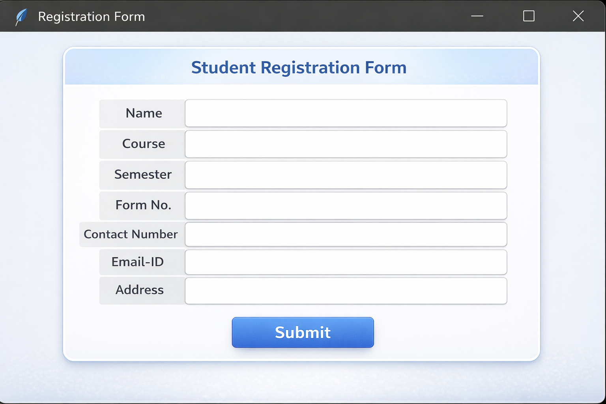

# Student Details GUI App using Python Tkinter

This project is a simple **Python GUI application** built using **Tkinter** that allows users to enter student details and automatically save them into an **Excel file** using the **OpenPyXL** library.

---

## ✨ Features
- User-friendly GUI form
- Automatic Excel (.xlsx) file creation
- Data stored row-wise
- Input validation
- Beginner-friendly Python project

---

## 🛠 Technologies Used
- Python 3
- Tkinter (GUI)
- OpenPyXL (Excel handling)

---

## 📁 Project Structure
student-details-gui-tkinter-excel/
│
├── main.py
├── requirements.txt
├── README.md
├── screenshot.png
└── wb.xlsx

---

## ▶ How to Run the Application
python main.py

---

## 🧪 How It Works
- User enters student details in the GUI form.
- Clicking Submit validates the inputs.
- Data is appended to wb.xlsx.
- Excel file is automatically created if it doesn't exist.

---

## 📄 Excel Output Format

| Name | Course | Semester | Form No | Contact | Email | Address |

---

## 🖼 Application Screenshot

---

## 🚀 Future Enhancements
- Add search functionality
- Add delete/update options
- Convert to database (SQLite)
- Improve UI design

---

## 🔁 Reusability
You can:
- Modify password length logic
- Improve GUI design
- Integrate with login systems
- Use in educational learning projects

---

## 🤝 Contribution
Pull requests are welcome.  
If you'd like to improve this project, feel free to fork the repository and submit enhancements.
